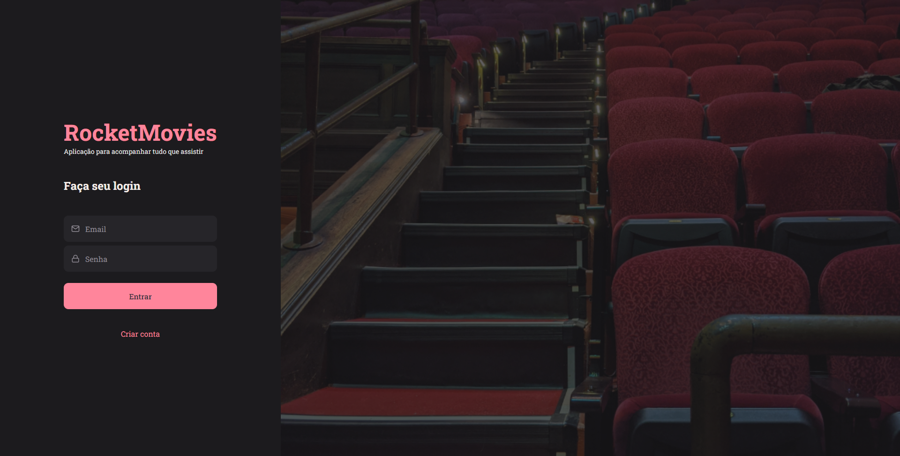
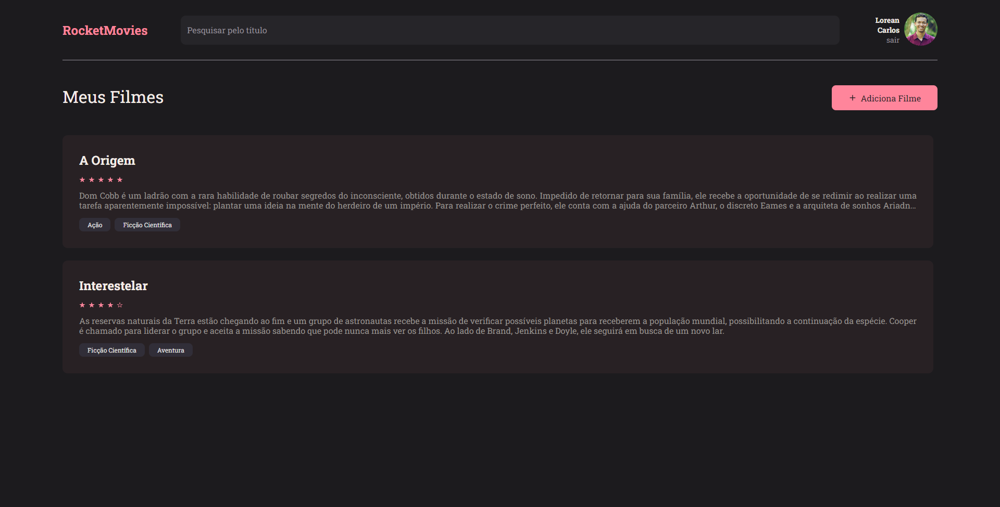

# Desafio 01 - Stage 09, Explorer.

Este é o projeto do último desafio do Stage 00, programa [Explorer - RocketSeat](https://rocketseat.com.br/).

## Índice

- [Projeto](#RocketMovies_FrontEnd)
  - [Screenshots](#screenshots)
  - [Tecnologias Utilizadas](#tecs)
  - [Autor](#autor)

## RocketMovies_FrontEnd

Este projeto é o resultado do conhecimento adquirido no programa Explorer, até o momento.  

### O Desafio

- Construir o layout completo de uma aplicação SPA utilizando [ReactJS](https://pt-br.reactjs.org/). A aplicação faz o gerenciamento de um catálogo de filmes, e contem funcionalidades bem legais que me proporcionaram uma ótima experiência ao contruí-las.
    - Inicialização rápida de um novo projeto com o [ViteJS](https://vitejs.dev/).
    - Criação de páginas reaproveitando Componentes.
    - Criação de elementos como Componentes do [ReactJS](https://pt-br.reactjs.org/).
    - Utilização de Styled Components.
    - Criação de Rotas Rápidas de Navegação.
    - Utilização de biblioteca que disponibiliza ícones Componentizados.
    - Criação de um input para substituição de imagem de perfil.
    

### Screenshots

## Tecs

Tecnologias

- HTML5
- CSS in JS
- JavaScript
    - React JS
    - Styled Components
    - Vite Js

## Autor

- LinkedIn - [Lorean Carlos](https://www.linkedin.com/in/loreancarlos/)
- Rocketseat - [Perfil](https://app.rocketseat.com.br/me/loreancarlos)
